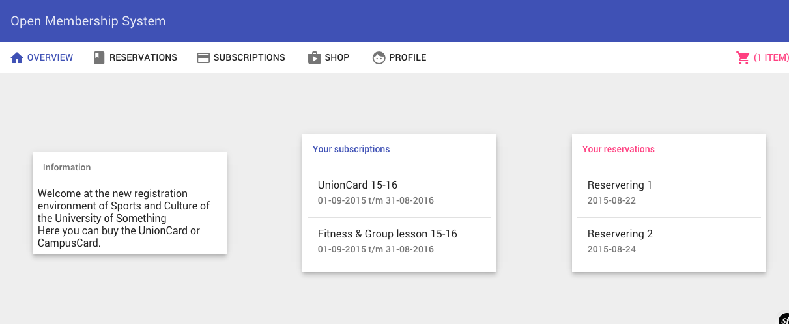

Open Membership System
======================

Proof of concept, very early stage. 
Built on Symfony 2.7 + Angular 1.4.

Installation/Development
-------------------------
0. Install composer, npm
0. Install bower and grunt-cli globally
0. Install dependencies `composer install; npm install; bower install`
0. `app/console server:run`
0. `grunt` for development (watch+livereload)

Screenshots
-----------

### Overview

### Shop

License
-------
MIT
